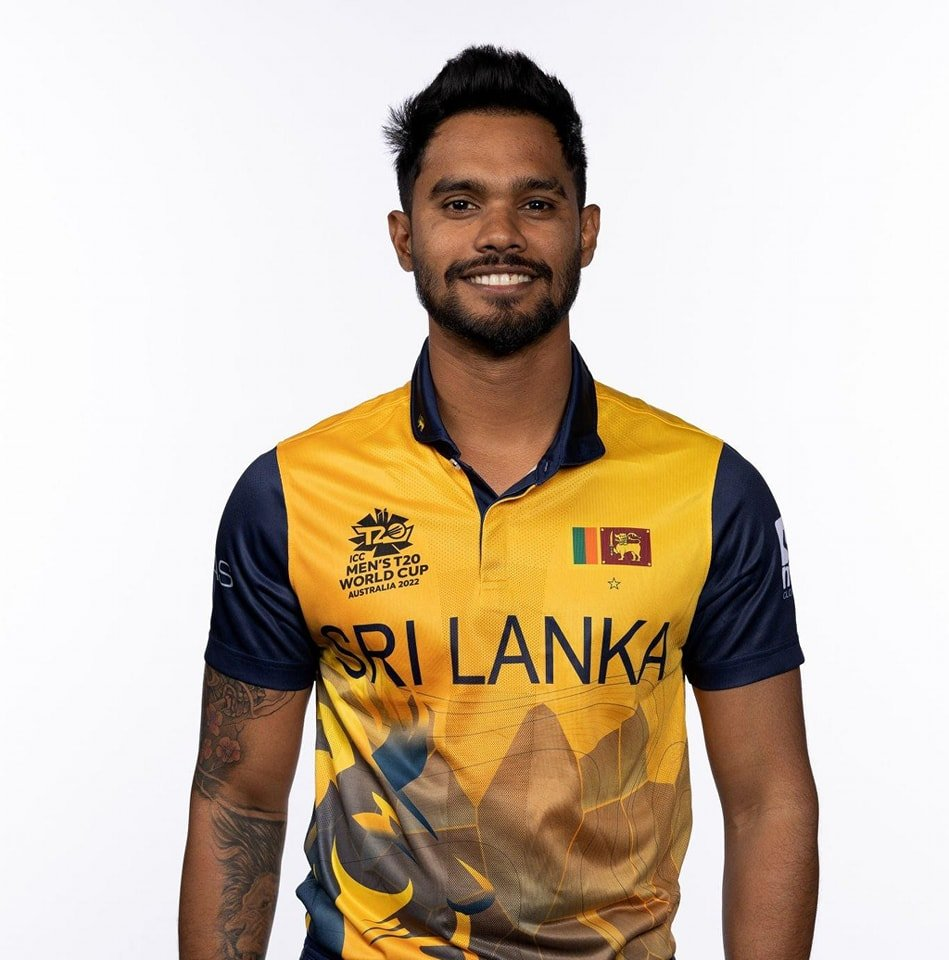
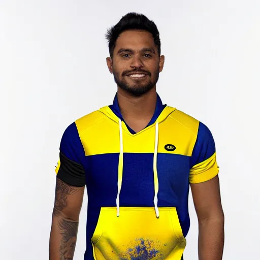

# Mini Virtual Try-On System

An AI-powered pipeline that allows users to perform virtual clothing try-ons using Latent Diffusion Inpainting.

##  How it Works
This system uses a **Stable Diffusion Inpainting Pipeline** (v1.5). 
1. **Input:** User uploads a portrait and provides a text prompt.
2. **Masking:** A manual brush tool creates a binary mask of the garment area.
3. **Synthesis:** The AI replaces the masked pixels with new textures based on the prompt, while maintaining the background and the user's facial identity.

## Tech Stack
- **Language:** Python
- **AI Framework:** Hugging Face `diffusers`
- **UI:** Gradio
- **Model:** `runwayml/stable-diffusion-inpainting`

## 📊Results
| Input Image | Output (New Outfit) |
|-------------|---------------------|
|  |  |
