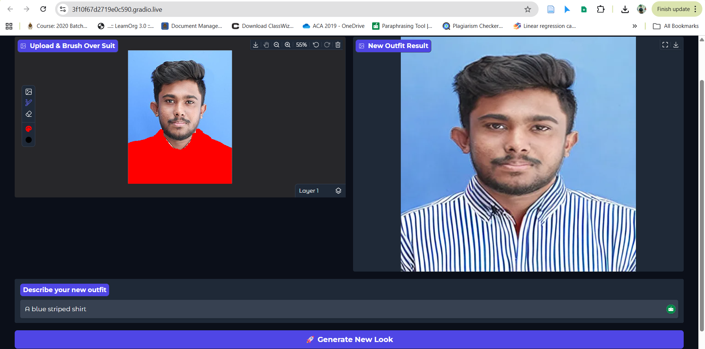

# Mini Virtual Try-On System

An AI-powered pipeline that allows users to perform virtual clothing try-ons using Latent Diffusion Inpainting.

##  How it Works
This system uses a **Stable Diffusion Inpainting Pipeline** (v1.5). 
1. **Input:** User uploads a portrait and provides a text prompt.
2. **Masking:** A manual brush tool creates a binary mask of the garment area.
3. **Synthesis:** The AI replaces the masked pixels with new textures based on the prompt, while maintaining the background and the user's facial identity.

## Tech Stack
- **Language:** Python
- **AI Framework:** Hugging Face `diffusers`
- **UI:** Gradio
- **Model:** `runwayml/stable-diffusion-inpainting`

## Results
| Input Image | Output (New Outfit) |
|-------------|---------------------|
|  |  |
|  |

## 1. Approach
I implemented a Latent Diffusion Inpainting pipeline using the Stable Diffusion v1.5 architecture. To ensure high fidelity and user control, I utilized a Human-in-the-Loop (HITL) masking strategy via a Gradio interface. By configuring the model with a Denoising Strength of 1.0 and a high Guidance Scale (15.0), I achieved a complete architectural swap of garment textures while preserving the user's facial identity and the original background lighting.

## 2. Challenges & Solutions

Challenge,Impact on Output,Technical Solution
Automated Cloth Detection,"Bounding boxes were imprecise, often masking parts of the skin or the background.",Manual Masking Interface: Pivoted to a Gradio-based brush tool to allow for pixel-perfect boundary definition.
Complex Text Inputs,"Stylistic or highly specific garment descriptions caused texture blurring or ""hallucinations.""","Prompt Engineering: Implemented a system that automatically appends quality modifiers (e.g., ""high quality, realistic fabric texture"") to user inputs."
Anchor Pixel Bias,"The AI tried to ""blend"" new clothes with the old suit, creating hybrid outfits (e.g., a red tie on a grey suit).","High Denoising & Negative Prompting: Set strength=1.0 to overwrite original pixels and added a negative_prompt to explicitly block ""suit"" and ""tie"" textures."

## 3. What I would improve
Automated Segmentation - Integrate Segment Anything Model (SAM) or MediaPipe to automatically detect clothes without user brushing.

Pose Preservation - Use ControlNet (Canny/Depth) to ensure that the folds of the new fabric perfectly match the user's body pose.

High-Res Upscaling - Add a Real-ESRGAN post-processing step to upscale the generated garment to 4K resolution.
